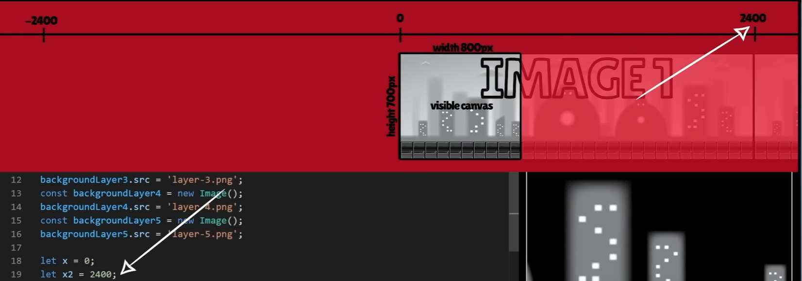

# Prototype 2

## Image gap issue



```js
let gameSpeed = 15;
let x = 0;
let x2 = 2400; // the width of backgroundLayer4 img 2400px

function animate() {
    ctx.clearRect(0, 0, CANVAS_WIDTH, CANVAS_HEIGHT);
    ctx.drawImage(backgroundLayer4, x, 0);
    ctx.drawImage(backgroundLayer4, x2, 0);

    if (x < - 2400) x = 2400;
    else x -= gameSpeed;

    if (x2 < - 2400) x2 = 2400;
    else x2 -= gameSpeed;

    requestAnimationFrame(animate);
}
```

The problem is that image 1 is drawnd at position `let x = 0;` and image2 is on position `let x2 = 2400`.
The problem is based on that that the two images ignore eachother. They are reset based on 2 different variables `x and x2` which are compleately disconected.
So if the **width** (_2400px_) of the image is not divisible by `gameSpeed` (_15_); It can happend that the gap grows larger over time.

Part of the gap is the `gameSpeed` because the _if_ statements that resets `x` and `x2` happen independently of eachother.
```js
    if (x < - 2400) x = 2400;
    else x -= gameSpeed;

    if (x2 < - 2400) x2 = 2400;
    else x2 -= gameSpeed;
```
We have situations where `x` resets and `x2` will move **15 pixels** to the left for that frame. (_15px because that is the current `gameSpeed`_).
The never reset on the same time because one of them is always visible on canvas. So when `x` resets  _image1_ resets.
```js
if (x < - 2400) x = 2400;
```
or when `x2` image 2 resets 
```js
if (x2 < - 2400) x2 = 2400;
```
we need to offset the other one by the amount of game speed to account for the fact that for that frame the other image kept moving, while the other one was reseting.

```js
if (x < - 2400) x = 2400 - gameSpeed;
else x -=gameSpeed;
if (x2 < - 2400) x2 = 2400 - gameSpeed;
else x2 -=gameSpeed;
```
now we lower the gap


`gameSpeed` is **15 pixels per frame** and the images resets when their x position is less than -2400. So unless 2400 which is my image width is divisible by the current speed with no remainder there will be always some leftover pixel creating a gap. This gap could even go larger and larger as the scrolling and resetting continues.
Some people deal with it by only allowing their game speed to be certain values so that image witdh is always divisible by the game speed without any remainder, but this is a limitation. In order for the game speed to be fully dynamic we need to make sure that our `x` and `x2` reset statements check position of the other image before they reset. And they offset its new position based on the current position of the other image.
That way even when gap is somehow created it auto correct itself next time around during the next reset.
We will do that by accounting for the current `x2` position in the `x` reset check.
```js
if (x < - 2400) x = 2400  + x2 - gameSpeed;
else x -=gameSpeed;
```
and account for current `x` position in the `x2` position check.
```js
if (x2 < - 2400) x2 = 2400  + x - gameSpeed;
else x2 -=gameSpeed;
```
keep in mind that when this rest checks happen `x` or `x2` are small numbers somewhere around __0__ at that point. This might be a bit tricky to visualize and there is a better approach to fixing this problem.
Refer to the `script.js` file.